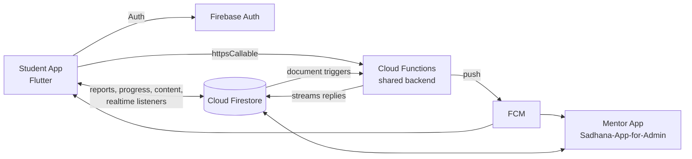

# FOLK — Student App

A Flutter + Firebase Android app that helps students track their daily spiritual practice (sadhana), stay connected with their mentor, and learn at their own pace.

## Overview

This is the **public student app** of the FOLK Spiritual Mentorship Platform, a mentorship programme for college students across multiple campuses (200+ students at the platform level). Students log daily sadhana reports, count japa rounds, read books in-app, follow a structured study course, compete on weekly and monthly leaderboards, and ask an AI assistant grounded in Srila Prabhupada's books.

Mentors ("guides") use the private companion app, **[Sadhana-App-for-Admin](https://github.com/KaushalPawar14/Sadhana-App-for-Admin)**, which reads the same Firestore data. Server-side logic (notifications, the AI assistant, leaderboards and challenges) runs in Firebase Cloud Functions that are shared across the platform and are **not part of this repository**.

Android package: `org.folksurat.students`

## Features

### Daily sadhana tracking
- Daily sadhana report forms, with separate flows for hostel residents and other students (`Questions.dart`, `HostelersPage/Sadhana.dart`).
- A calendar view of past reports, merged across both report collections so history survives a residence change (`Calendar.dart`).
- Scorecards and charts (fl_chart) for chanting, book reading, daily services and Bhagavatam class attendance, with weekly and monthly breakdowns (`lib/scores/`).
- Submissions trigger server-side notifications to the student's own mentor.

### Practice tools
- **Japa counter**: counts beads to 108 and banks completed rounds to a lifetime total, with mantra audio (just_audio), a completion chime and a custom-length vibration.
- **ABCDE journey**: a home screen with one card per area of practice, showing live progress from Firestore.
- **Service Bank**: a 19-step service curriculum, with services assigned by the mentor and per-service status controls.

### Learning content
- **In-app book reader**: downloads DOCX books, caches them (flutter_cache_manager) and parses the Word XML (archive + xml) into chapters, keeping headings, bold/italic runs and inline images. Supports a standing reading-language preference.
- **RDUA Modules**: a 50-topic, two-chapter study course with per-chapter read tracking.
- **Audiobook / podcast modules** across five categories.

### AI assistant
- A chat assistant backed by the `studentChat` Cloud Function (callable, `asia-south1`). Answers are grounded in Srila Prabhupada's books, letters and talks.
- Replies stream in: the app creates the reply document's ID up front and listens to it in Firestore while the function writes the text in pieces.
- Past conversations are browsable by date, and a daily encouragement message comes from `generateDailyEncouragement`.
- The backend can flag messages that show distress so the mentor is alerted. The student app deliberately never shows this flag; students are told once, up front, how it works.
- A floating assistant button stays on screen over every page.

### Community and mentorship
- **Association**: students request meetings with their mentor.
- **Expeditions**: browse pilgrimages and retreats and register for them.
- **RDUA Friends**: friend requests, friend groups and user search. Search never shows a student's mobile number. The voice-room screens are there, but the voice backend is currently a stub.
- **Competitions**: weekly and monthly top-3 leaderboards, the "Folk Analysis" scorecard, a read-only view of mentor-created group chanting challenges, plus achievement badges with Lottie animations.

### Platform and release
- Sign-in with email/password or Google (Firebase Auth), password reset, and profile completion before the student reaches the main app.
- FCM push notifications for foreground, background and terminated states, with deep links to the right screen and per-type notification settings.
- **Forced update**: at launch the app compares its installed build (package_info_plus) with a minimum version in Firestore (`appConfig/versions`). If the build is too old, a blocking screen links to the Play Store. If the check itself fails, the app still opens.
- Dark mode (Provider + SharedPreferences) and responsive sizing (sizer).
- Release signing reads from an untracked `android/key.properties`, and release builds fail with a clear message when it is missing.

## Tech stack

| Layer | Technology |
|---|---|
| App | Flutter (Dart SDK ^3.6), Material, Provider |
| Backend | Firebase Authentication, Cloud Firestore, Cloud Functions (callables), Firebase Cloud Messaging |
| Auth | Email/password, Google Sign-In |
| Notifications | firebase_messaging, flutter_local_notifications |
| Content | archive + xml (DOCX parsing), flutter_cache_manager, just_audio |
| UI | fl_chart, table_calendar, lottie, confetti, animate_do, curved_navigation_bar |
| Release | package_info_plus + url_launcher (forced update), Gradle release signing |

## Architecture



The client reads and writes Firestore directly for most features and uses realtime listeners for live progress. Cloud Functions handle AI chat, notifications when reports are submitted, leaderboards and challenges.

## Project structure

```
lib/
├── main.dart              # Firebase init, auth gate, background startup jobs
├── pages/                 # Screens: sadhana, chanting, books, assistant, friends, expeditions...
├── HostelersPage/         # Hostel-resident sadhana form
├── scores/                # Charts, weekly/monthly results, leaderboards
├── services/              # Auth, FCM, competition logic, scorecard updates, cleanup
├── models/                # Firestore data models
└── utils/                 # Nav bar, overlays, notification router, force-update check, theming
assets/                    # Fonts (Satoshi), audio, Lottie animations, images
android/                   # Android project (package org.folksurat.students)
```

## Getting started

Prerequisites: Flutter SDK (Dart ^3.6) and an Android device or emulator.

```bash
git clone https://github.com/KaushalPawar14/Sadhana-App-for-Users.git
cd Sadhana-App-for-Users
flutter pub get
```

To connect your own Firebase project:

1. Create a Firebase project and turn on Authentication (Email/Password and Google), Firestore and Cloud Messaging.
2. Register an Android app with package `org.folksurat.students`, or change `applicationId` to your own.
3. Generate the config with the FlutterFire CLI. This writes `lib/firebase_options.dart` and `android/app/google-services.json`:
   ```bash
   flutterfire configure
   ```
4. Run the app:
   ```bash
   flutter run
   ```

The AI assistant and server-side notifications need the platform's Cloud Functions, which are not in this repo. Release builds also need `android/key.properties` pointing to your own keystore.

## Part of FOLK

This app is one part of the FOLK Spiritual Mentorship Platform, which also includes the mentor app and a Firebase backend. At the platform level, 29 Cloud Functions handle scheduled jobs, event triggers and AI workflows, including a RAG assistant over 100+ books.

- Mentor app: [Sadhana-App-for-Admin](https://github.com/KaushalPawar14/Sadhana-App-for-Admin)
- Portfolio: [portfolio-kaushal-chi.vercel.app](https://portfolio-kaushal-chi.vercel.app)

Built by **Kaushal Pawar**.
